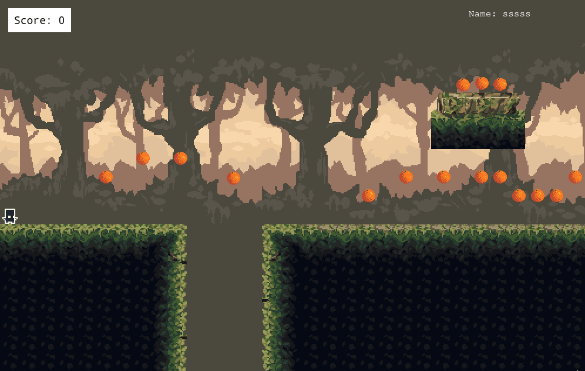

<h1 align="center">
  <br>
  <a href="https://github.com/smcommits/moviecop/archive/develop.zip"></a>
</h1>

<h1 align="center">Survive The Jungle</h1>

<p align="center">
  <a href="#about">About</a> •
  <a href="#prerequisites">Prerequisites</a> •
  <a href="#getting-started">Getting Started</a> •
  <a href="#contributing">Contributing</a> •
  <a href="#authors">Authors</a> •
  <a href="#license">License</a>
</p>

---

## About
Survive the jungle is a 2D platformer game. The game comes with basic features like collectible items and lethal obstacles. 

## Live Demo
[Click here](https://dry-fortress-25033.herokuapp.com/) to visit the live demo of the application. 

Note: The application is hosted on the free tier of Heroku and therefore the images attached will not persist after the next dyno reset. 

## GDD (Game Design Document)

The Game Design Document is a highly descriptive design manual for a video game. It is used to efficiently design and develop a video game. The GDD of this game can be found in the following link. 
[Game Design Documentation](./docs/GDD.md)

## Getting Started

### Prerequisites

Before running the application locally, the user will have to make sure of the following:
- Node JS Installed on your local machine. Please use [this link](https://nodejs.org/en/).
- Installing NPM if not already installed.

You also need to make sure that yarn is up to date
- yarn install --check-files


### Getting Started

#### Step 1

https://github.com/smcommits/survive_the_jungle.git   
```
git clone https://github.com/smcommits/moviecop
```
       
Alternatively, you can click [this link](https://github.com/smcommits/survive_the_jungle/archive/develop.zip) to download the repo as a zip file.

#### Step 2

Navigate to the game folder
```
cd survive_the_jungle
```

#### Step 3

Install all the dependencies by running the following command. Dependencies are just normal files and programs that are necessary to run the game. 
```
npm install
```

#### Step 4
While you are in the root folder of the Game, which means that in the topmost folder of the game, run the following command to launch the game in your browser
```
npm run start
```

Alternatively, you can navigate to the dist folder and run index.html directly in your browser.
### Step 5

## Game Rules

The Game rules are pretty simple.
- You will be spawned in a 2D platform game. 
- You have to run and reach the end of the jungle. 
- While running, you have to collect the fruits. Which will help you score points. 
- You will also have to avoid the spikes. They will result in instant death
- Each fruit gives you 10 points. 
- You can take small jumps and long jumps. 
- Please note, although taking long jumps can help you it comes with its limitations. After a long jump, the player might fall with a lot of speed and
can fail to grab support. Falling down or outside of the world. Which will result in death. 


## How To Play

- After launching the game, you will be asked to enter your name. 
- After you have entered the game, you will be spawned in a 2D world. 
- To move your player, you can use arrow keys or w, a, s, d, to move forward, left, backward, and rightwards respectively. 
- To take the long jumps, you will have to press Spacebar. 

## Authors

👤 **Anas Siddiqui**
  - GitHub: [@githubhandle](https://github.com/smcommits)
  - LinkedIn: [linkedIn](https://linkedin.com/in/sm-anas)


## 🤝Contributing

Contributions, issues, and feature requests are welcome!

## Show your support

Give a ⭐️ if you like this project!

## Acknowledgments

### Awesome Tileset Designed By (Sazdi Artis)[https://szadiart.itch.io/platformer-fantasy-set1?download]
### The tutorial by [Zeneva](https://phasertutorials.com/creating-a-phaser-3-template-part-1/) helped a ton. 

## License

This project is [MIT](./LICENSE) licensed.


